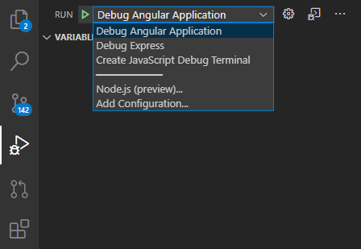

# ~~M~~EAN Stack using Typescript: Boilerplate Code

### :artificial_satellite: Overview
- This code enables the Angular as well as Express code to run in debug mode
- The Angular and the Express code
  - are written in TypeScript
  - are able to run in debug mode (pauses execution at breakpoints)
  - support hot reload
  - could be debugged entirely in VS Code (no more `console.log` or adding breakpoints in Chrome)

---

### :heavy_check_mark: Prerequisites
- [NodeJS](https://nodejs.org/)
- [Nodemon](https://www.npmjs.com/package/nodemon)
- [Debugger for Chrome](https://marketplace.visualstudio.com/items?itemName=msjsdiag.debugger-for-chrome)

---

### :clipboard: Clone the repository

```bash
$ git clone https://github.com/usama251993/ts-boilerplate.git
```

---

### :floppy_disk: Install dependencies on `client` and `server` separately

```bash
$ cd client
$ npm install

$ cd ..
$ cd server
$ npm install
```

---

### :rocket: Launch
Select the desired launch configuration and hit `Run` to start debugging



The `Debug Angular` configuration would open up a new incognito window and the debugging would continue until that window is not closed

The `Debug Express` configuration would start debugging within VS Code

---

### :page_with_curl: References
1. [TypeScript Debugging With Visual Studio Code](https://code.visualstudio.com/docs/typescript/typescript-debugging)
2. [How to debug TypeScript with VS Code | by Philipp Kief | Medium](https://medium.com/@PhilippKief/how-to-debug-typescript-with-vs-code-9cec93b4ae56)
3. [Debugging Angular apps with Angular CLI](https://github.com/microsoft/vscode-recipes/tree/master/Angular-CLI)
4. [Node/Express Controller inheritance](https://blog.cloudboost.io/node-express-controller-inheritance-2d5b2661ee7d)
5. [Use TypeScript to Create a Secure API with Node.js and Express](https://auth0.com/blog/use-typescript-to-create-a-secure-api-with-nodejs-and-express-creating-endpoints/)
6. [TypeScript Express Tutorial](https://wanago.io/2018/12/03/typescript-express-tutorial-routing-controllers-middleware/)
7. [Developing an Express Application Using TypeScript](https://dev.to/aligoren/developing-an-express-application-using-typescript-3b1)
8. ~~[How to wrap Axios inside Rxjs with Typescript and React](https://medium.com/front-end-weekly/how-to-wrap-axios-inside-rxjs-with-typescript-and-react-6c21e47dcb63)~~ Used [`axios-observable`](https://www.npmjs.com/package/axios-observable)
9. [How to build a backend app with TypeScript, Node.js, and Express](https://medium.com/javascript-in-plain-english/typescript-node-js-express-js-create-a-backend-application-f5110dbe5c19)

---

### :raising_hand_man: Post Scriptum
The code may contain
- Redundant dependencies
- Lot of comments in [`tsconfig.json`](server/tsconfig.json)

All hail :raised_hands: [Linus Torvalds](https://github.com/torvalds)

Keep the humor as a software developer always alive :smiling_imp: because there ain't an art :art: like coding :nerd_face:
